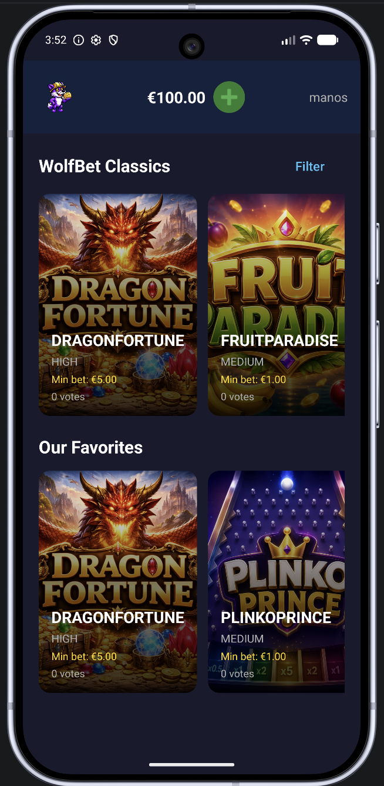
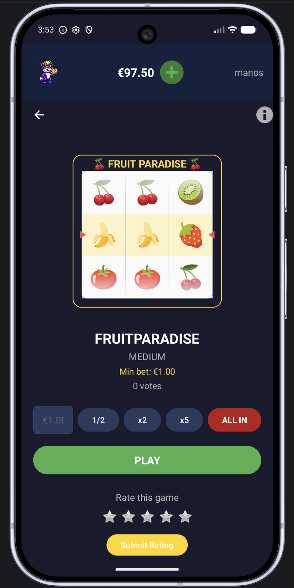
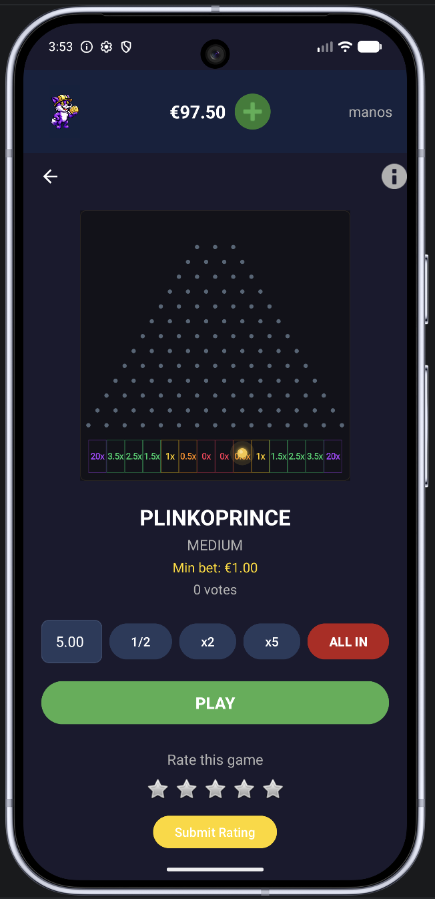

# 🐺 WolfBet — Distributed Online Casino Platform

**A fault-tolerant, distributed betting system built in Java, featuring a Master-Worker architecture with active replication, MapReduce-based bet processing, and a fully animated Android client.**

> 🏆 *Awarded best project among all student submissions in the Distributed Systems course at Athens University of Economics and Business (AUEB).*

---

## Screenshots
 
<p align="center">
  
  &nbsp;&nbsp;
  
  &nbsp;&nbsp;
  
</p>
---

## Overview

WolfBet is a distributed online casino application developed as part of the Distributed Systems course. The system consists of a **Java backend** implementing a scalable Master-Worker architecture and an **Android frontend** offering six fully animated casino games. The platform supports concurrent players, parallel bet processing, fault-tolerant game hosting, and real-time result aggregation.

---

## Architecture

```
┌────────────┐        TCP         ┌────────────┐        TCP        ┌─────────────┐
│  Android   │ ◄──────────────► │   Master   │ ◄──────────────► │  Worker 1   │
│  Client    │                    │            │                   │  Worker 2   │
└────────────┘                    │  ┌──────┐  │        TCP        │  Worker N   │
                                  │  │Health│  │ ◄──────────────► └──────┬──────┘
┌────────────┐        TCP         │  │Check │  │                         │
│  Manager   │ ◄──────────────► │  └──────┘  │                         │ TCP
│  Client    │                    └────────────┘                         ▼
└────────────┘                                                   ┌─────────────┐
                                                                 │   Reducer    │
                                  ┌────────────┐                 └─────────────┘
                                  │    SRG     │
                                  │ (Random    │
                                  │ Generator) │
                                  └────────────┘
```

### Components

- **Master** — Central coordinator that routes requests, manages game-to-worker mappings, and orchestrates the MapReduce pipeline. Runs a daemon health-check thread that monitors worker availability.
- **Workers** — Process bets, host games, and maintain game state. Each worker runs games independently and forwards results to the Reducer.
- **Reducer** — Aggregates partial results from workers into final statistics (e.g., total bets, profits per player).
- **SRG (Secure Random Generator)** — Dedicated service that feeds random numbers to workers via a **Producer-Consumer** pattern using a bounded buffer with `wait()`/`notify()` synchronization.
- **Manager Client** — Administrative client for creating/configuring games, viewing statistics, and managing the platform.
- **Android Client** — Player-facing mobile app with animated casino games.

---

## Key Features

### Active Replication & Fault Tolerance

Each game is assigned a primary worker and one or more backup workers using a deterministic circular selection strategy. All replicas process the same messages independently (state machine replication). If a primary worker goes down:

1. The Master's health-check daemon detects the failure
2. The first alive backup is promoted to **LEADER** mode
3. Remaining backups continue in **BACKUP** mode
4. When the failed worker recovers, it sends a `WORKER_BOOT` message to trigger state synchronization

### MapReduce Pipeline

Aggregate operations (e.g., "show all available games") are distributed across workers in a Map phase, with partial results forwarded to the Reducer for aggregation. This allows the system to scale horizontally — adding workers increases throughput.

### Producer-Consumer Random Number Generation

Each game maintains a `RandomNumberBuffer` — a bounded buffer where a dedicated producer thread generates random numbers and game threads consume them. The buffer uses `wait()`/`notify()` for synchronization, with support for dynamically enabling/disabling games via `notifyAll()` on state changes.

### Thread Safety

All shared data structures are encapsulated in synchronized repository classes (`GameRepository`, `DownWorkersLog`, `GameToWorkersMap`), avoiding scattered `synchronized` blocks throughout the codebase. Fields are marked `final` where possible, and reference reassignment across threads is prevented by design.

### Communication

All inter-node communication uses **TCP sockets** with Java Object Serialization (`ObjectInputStream` / `ObjectOutputStream`). Each incoming connection is handled by a dedicated thread (thread-per-connection model).

---

## Android Client

The Android app provides an immersive casino experience with six custom-built animated games, each implemented as a custom `View` with `Canvas` rendering and `ValueAnimator`-driven animations.

### Games

| Game | Type | Highlight |
|------|------|-----------|
| 🎰 **Roulette** | Wheel spin | Spinning wheel with red/black/green slices, gold marker, deceleration animation |
| 🎡 **Lucky Spin** | Prize wheel | 11-segment wheel with rotation math that guarantees the pointer lands on the server-determined segment |
| 🍒 **Fruit Paradise** | Slot machine | 3-reel fruit slots with cascading symbol animations |
| 🐉 **Dragon Fortune** | Slot machine | 3-reel mythical creature slots with 40x jackpot on triple match |
| 📍 **Plinko Prince** | Ball drop | 13-row peg board with 14 symmetric multiplier buckets; pre-computed ball paths ensure visual randomness while guaranteeing the correct outcome |
| 🏴‍☠️ **Pirate Treasure** | Adventure | Treasure-hunting themed game with custom animations |

All game animations are purely decorative — the actual result is determined server-side and returned before the animation plays. Each game view implements the `AnimatedGameView` interface, allowing `GameFragment` to dispatch animations polymorphically without game-specific logic.

### App Features

- User authentication with session management
- Real-time balance tracking with bet validation
- Star-based game rating system
- Banner-style slide-in notifications for server responses
- Game info popups with rules and payout tables

---

## Tech Stack

| Layer | Technologies |
|-------|-------------|
| **Backend** | Java, TCP Sockets, Object Serialization, Multi-threading |
| **Android** | Java, Android SDK, Custom Views, Canvas API, ValueAnimator |
| **Patterns** | Master-Worker, MapReduce, Producer-Consumer, Active Replication, Strategy Pattern, State Machine Replication |
| **Concurrency** | `synchronized`, `wait()`/`notify()`, `volatile`, Daemon Threads, Thread-per-Connection |

---

## Project Structure

```
WolfBet/
├── Backend/
│   ├── src/
│   │   ├── Master.java
│   │   ├── Worker.java
│   │   ├── Reducer.java
│   │   ├── SRG.java
│   │   ├── HandleThreadMaster.java
│   │   ├── HandleThreadWorker.java
│   │   ├── HandleThreadReducer.java
│   │   ├── RandomNumberBuffer.java
│   │   ├── GameRepository.java
│   │   ├── DownWorkersLog.java
│   │   ├── GameToWorkersMap.java
│   │   └── model/
│   │       └── enums/
│   │           ├── PlayGameResultType.java
│   │           ├── ActionType.java
│   │           └── WorkerMode.java
│   └── config.properties
│
└── Frontend/
    └── app/
        └── src/
            └── main/
                ├── java/.../
                │   ├── MainActivity.java
                │   ├── LoginActivity.java
                │   ├── HomeFragment.java
                │   ├── GameFragment.java
                │   ├── HomeViewModel.java
                │   ├── AnimatedGameView.java
                │   ├── RouletteView.java
                │   ├── LuckySpinView.java
                │   ├── FruitParadiseView.java
                │   ├── DragonFortuneView.java
                │   ├── PlinkoView.java
                │   └── PirateTreasureView.java
                └── res/
```

---

## Getting Started

### Prerequisites

- Java 17+
- Android Studio (for the mobile client)

### Running the Backend

Start the components in the following order:

```
1. Reducer
2. SRG
3. Workers (1 to N)
4. Master
```

The startup order matters — the Reducer must be running before Workers attempt to connect.

### Configuration

Network settings (ports, hosts, health-check timeouts) are configured in `config.properties`.

---

## License

This project was developed for academic purposes as part of the Distributed Systems course at the Athens University of Economics and Business (AUEB), Department of Informatics.
